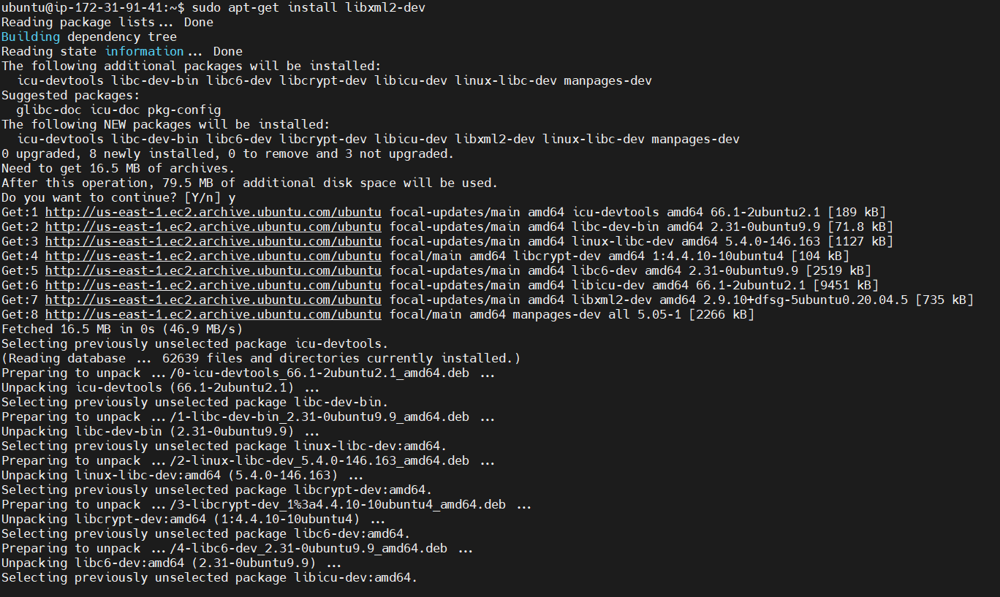

##  **PROJECT 8 - LOAD BALANCER SOLUTION WITH APACHE**

## STEP 1 – APACHE CONFIGURATION AS A LOAD BALANCER

### Creation of an ubuntu server, named Project-8-apache-lb in addition to nfs, web1 and web2 servers created earlier

### Opening TCP port 80 on Project-8-apache-lb by creating an Inbound Rule in Security Group

## STEP 2 – APACHE LOAD BALANCER INSTALLATION ON LOAD BALANCER SERVER AND CONFIGURATION POINTING TRAFFIC FROM LB TO WEB SERVERS 1 AND 2

### Installation of apache2

`sudo apt update`

`sudo apt install apache2 -y`

`sudo apt-get install libxml2-dev`

### Modules enabling

`sudo a2enmod rewrite`

`sudo a2enmod proxy`

`sudo a2enmod proxy_balancer`

`sudo a2enmod proxy_http`

`sudo a2enmod headers`

`sudo a2enmod lbmethod_bytraffic`

### Activating the new configurations above by restarting apache servvices

`sudo systemctl restart apache2`

`sudo systemctl status apache2`

## STEP 2 – CONFIGURATION OF LOAD BALANCING

### Load balancer configuration

`sudo vi /etc/apache2/sites-available/000-default.conf`

### Restarting apache server after load bbalancing configuration

`sudo systemctl restart apache2`

`sudo systemctl status apache2`

### Verifying successfulness of the configuration

[TOOLING WEBPAGE](https://52.87.15.63/index.php)

### Unmounting /var/log/httpd/ from web servers 1 and 2 to have their own log directory

`sudo tail -f /var/log/httpd/access_log`

### Local DNS names resolution

`sudo vi /etc/hosts`

### Curl web 1 and 2 from lb server

`curl http://Web1`

`curl http://Web2`

